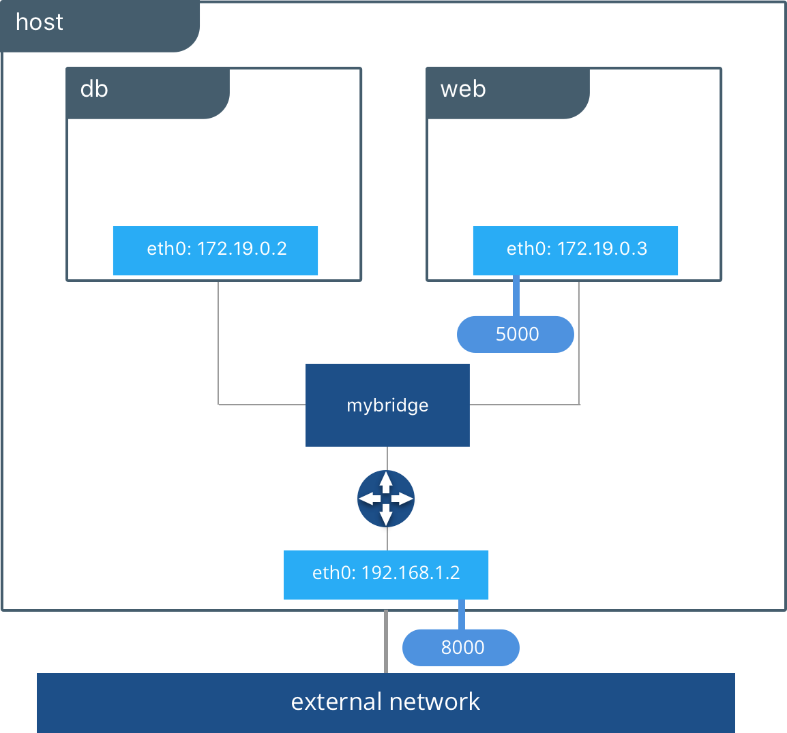

# Deploy a Flask application in Python with Gunicorn

This document explains how to set up a Flask WSGI application on a Gunicorn WSGI server in a Podman container and get access via localhost, see [Deploy Flask on Gunicorn (Red Hat)](https://developers.redhat.com/articles/2023/08/17/how-deploy-flask-application-python-gunicorn).

- api.py
- boot.sh
- Dockerfile
- environment.yml
- gunicorn_config.py
- local_image_build.sh

Run the container with Podman Desktop:
```bash
podman run --name flask_container -p 5000:8080  xrc-image-flask
```
```bash
[2024-03-14 14:04:28 +0000] [1] [INFO] Starting gunicorn 20.1.0
[2024-03-14 14:04:28 +0000] [1] [INFO] Listening at: http://0.0.0.0:5000 (1)
[2024-03-14 14:04:28 +0000] [1] [INFO] Using worker: threads
[2024-03-14 14:04:28 +0000] [4] [INFO] Booting worker with pid: 4
[2024-03-14 14:04:28 +0000] [6] [INFO] Booting worker with pid: 6
```
Visit ``localhost:5000/``  in the browser to see that it is working:
```bash
{"message":"Hello World"}
```

## Remarks
```bash
[2024-03-14 14:04:28 +0000] [1] [INFO] Listening at: http://0.0.0.0:5000 (1)
```
It is possible to reach the gunicorn server from localhost on the host (with IP address 127.0.0.1 on the host) when the gunicorn server is bound to 0.0.0.0, but the server cannot be reached from localhost when it is bound to 127.0.0.1 (the IP address in the container): if the server is listening at all addresses in the container, it can also listen at the address to which a host address is eventually mapped. One can restrict the server to listen at a specific address.
For example,  
```bash
podman container inspect <container_name>
```
shows that the address of the container is 10.88.0.2:
```bash
 "Networks": {
                    "podman": {
                         "EndpointID": "",
                         "Gateway": "10.88.0.1",
                         "IPAddress": "10.88.0.2",
                         "IPPrefixLen": 16,
                         "IPv6Gateway": "",
                         "GlobalIPv6Address": "",
                         "GlobalIPv6PrefixLen": 0,
                         "MacAddress": "12:1b:5d:26:59:75",
                         "NetworkID": "podman",
                         "DriverOpts": null,
                         "IPAMConfig": null,
                         "Links": null,
                         "Aliases": [
                              "2824cc0d18ca"
                         ]
                    }
               }
```
Using ``gunicorn -b 10.88.0.2:8080`` instead of ``gunicorn -b 0.0.0.0:8080`` restricts the access, but the server can still be reached because the host is connected to a network bridge.



```bash
➜  ~ podman network ls            
NETWORK ID    NAME        DRIVER
2f259bab93aa  podman      bridge
➜  ~ podman network inspect podman
[
     {
          "name": "podman",
          "id": "2f259bab93aaaaa2542ba43ef33eb990d0999ee1b9924b557b7be53c0b7a1bb9",
          "driver": "bridge",
          "network_interface": "podman0",
          "created": "2024-03-14T16:20:39.188636628+01:00",
          "subnets": [
               {
                    "subnet": "10.88.0.0/16",
                    "gateway": "10.88.0.1"
               }
          ],
          "ipv6_enabled": false,
          "internal": false,
          "dns_enabled": false,
          "ipam_options": {
               "driver": "host-local"
          }
     }
]
```
We can verify that it still works:
```bash
[2024-03-14 15:57:37 +0000] [1] [INFO] Starting gunicorn 20.1.0
[2024-03-14 15:57:37 +0000] [1] [INFO] Listening at: http://10.88.0.2:8080 (1)
[2024-03-14 15:57:37 +0000] [1] [INFO] Using worker: threads
[2024-03-14 15:57:37 +0000] [4] [INFO] Booting worker with pid: 4
[2024-03-14 15:57:37 +0000] [6] [INFO] Booting worker with pid: 6
```
and ``localhost:5000/`` shows the expected message
```bash
{"message":"Hello World"}
```
